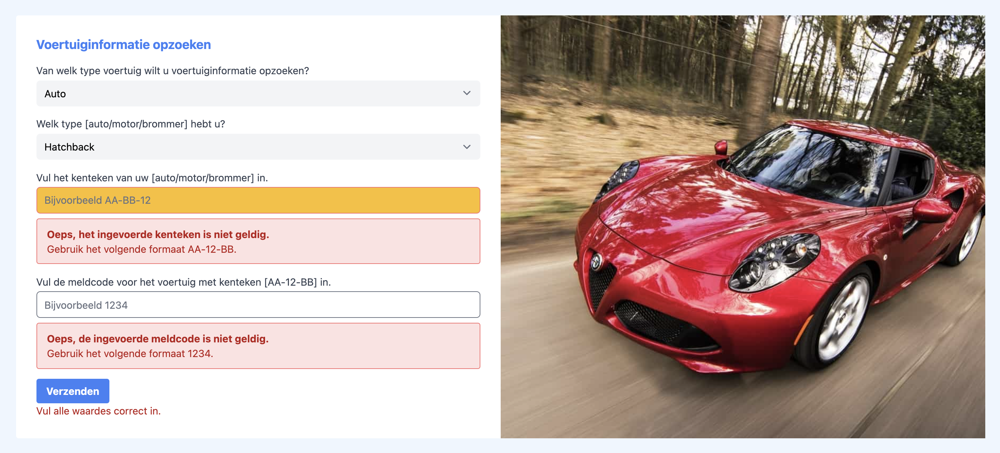

# Centraal Beheer code challenge

Super tof dat je interesse hebt om bij Centraal Beheer aan de slag te gaan! We werken elke dag met een grote groep van developers aan de website van Centraal Beheer. Deze groep van developers willen we heel graag uitbreiden. Daarbij vinden we opleiding, werkervaring of achtergrond eigenlijk helemaal niet zo waardevol. Belangrijker is dat je talent hebt en de juiste motivatie. Daarom kun je bij ons ook solliciteren door mee te doen aan onze code-challenge. 

## Wat is de Centraal Beheer code challenge?
De Centraal Beheer code challenge is een laagdrempelige front-end opdracht waarbij je een aantal nieuwe functionaliteiten bouwt voor een voorbeeld-applicatie. Wij reviewen je code, vinden we jouw oplossing tof? Dan nodigen we je graag uit voor een eerste kennismakingsgesprek.

## De challenge
Bij Centraal Beheer werken we veel met formulieren. Formulieren om je schade te melden, een nieuwe verzekering af te sluiten, etc.

Deze formulieren zijn vaak gebouwd in Angular. 

In deze code challenge ga je aan de slag met een voorbeeldformulier. De styling (we gebruiken voor deze challenge tailwind https://tailwindcss.com/) en html is al klaar maar we missen nog wat functionaliteit.

### Requirements:
Bouw het voorbeeldformulier (zie src/app/app.component.html voor de huidige html) verder af. We verwachten dat je applicatie in ieder geval (een deel van) de volgende requirements bevat:

Functionaliteiten:
- De gebruiker moet het type voertuig kunnen kiezen
    - Mogelijke keuzes:
        - auto
        - motor
        - scooter
- De afbeelding rechts van het formulier moet wijzigen op basis van de keuze van de gebruiker. De volgende combinaties zijn mogelijk:
    - auto: assets/auto.jpg
    - motor: assets/motor.jpg
    - scooter: assets/scooter.jpg     
- De gebruiker moet het subtype van het voertuig kunnen kiezen.
    - Mogelijke subtypes voor voertuig auto:
        - Hatchback
        - Sedan
        - Station
        - Cabriolet
        - Coupé
        - Multi Purpose Vehicle (MVP)
        - Terreinauto
    - Mogelijke subtypes voor voertuig motor:
        - All-road
        - Naked
        - Enduro
        - Race
        - Toermotor
        - Chopper
        - Zijspan
    - Mogelijke subtypes voor voertuig scooter:
        - Voor scooters kan de gebruiker geen subtype kiezen
- Implementeer kenteken formatting als volgt:
    - Voeg een streepje in tussen de cijfers en letters van het kenteken. AA14BB wordt dan dus AA-14-BB
    - Bij lettercombinaties van 4 karakters: voeg een streepje in na 2 karakters. 12AABB wordt dan dus 12-AA-BB
- Implementeer een basis kenteken validatie:
    - Maak gebruik van de volgende library om kenteken validatie te implementeren: https://www.npmjs.com/package/rdw-kenteken-check
    - Is de ingevoerde waarde invalid? Toon dan de volgende error-message (on-blur van het veld): "Helaas is het ingevoerde kenteken niet geldig. Probeer het opnieuw." 

### Technische vereisten:
- Splits de html op in logische Angular componenten
- Maak gebruik van Angular dynamic forms om je formulier op te bouwen
    
## Extra uitdaging?
- Wil je laten zien wat je nog meer kunt? Kun je bijvoorbeeld al unit testen schrijven, heb je ervaring met NGRX of ben je dol op UX en vind je de huidige opzet wel wat mager? Ga lekker aan de gang met je eigen idee en laat ons zien wat je kunt! Je mag natuurlijk ook Tailwind compleet verwijderen en je eigen css-implementatie toevoegen.

## Randvoorwaarden
- Om de challenge gelijkwaardig te houden voor alle kandidaten verwachten we dat je niet meer dan 2 - max 4 uur aan de challenge besteedt. Nog niet klaar met alle requirements na 4 uur? Geen probleem, stuur gewoon in wat je hebt. We vinden kwaliteit en oog voor details veel belangrijker dan dat je alle requirements hebt gerealiseerd.
- Maak een fork van deze Github naar je eigen Github account en push jouw oplossing. Stuur ons een linkje van je oplossing.

## Technische details

This project was generated with [Angular CLI](https://github.com/angular/angular-cli) version 12.2.3.

## Development server

Run `ng serve` for a dev server. Navigate to `http://localhost:4200/`. The app will automatically reload if you change any of the source files.

## Code scaffolding

Run `ng generate component component-name` to generate a new component. You can also use `ng generate directive|pipe|service|class|guard|interface|enum|module`.

## Build

Run `ng build` to build the project. The build artifacts will be stored in the `dist/` directory.

## Running unit tests

Run `ng test` to execute the unit tests via [Karma](https://karma-runner.github.io).

## Running end-to-end tests

Run `ng e2e` to execute the end-to-end tests via a platform of your choice. To use this command, you need to first add a package that implements end-to-end testing capabilities.

## Further help

To get more help on the Angular CLI use `ng help` or go check out the [Angular CLI Overview and Command Reference](https://angular.io/cli) page.
